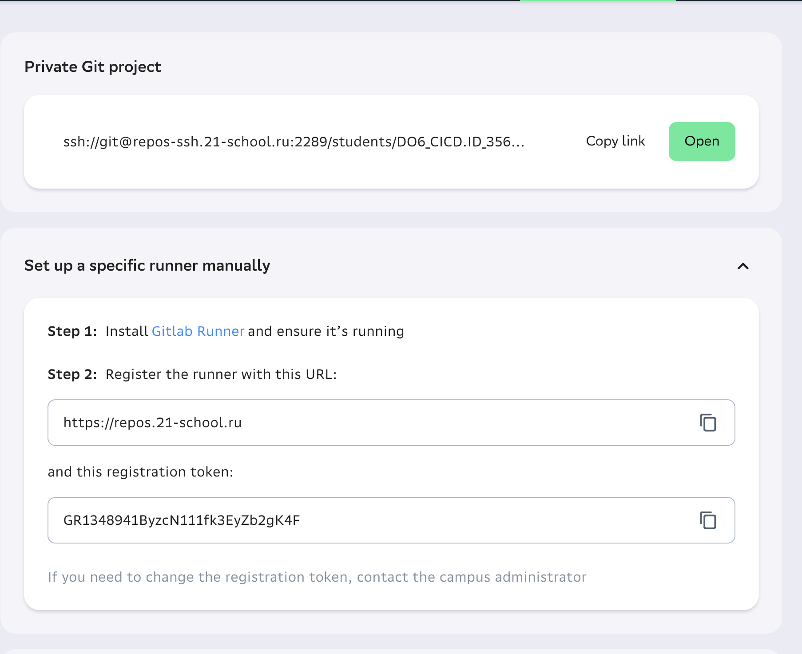
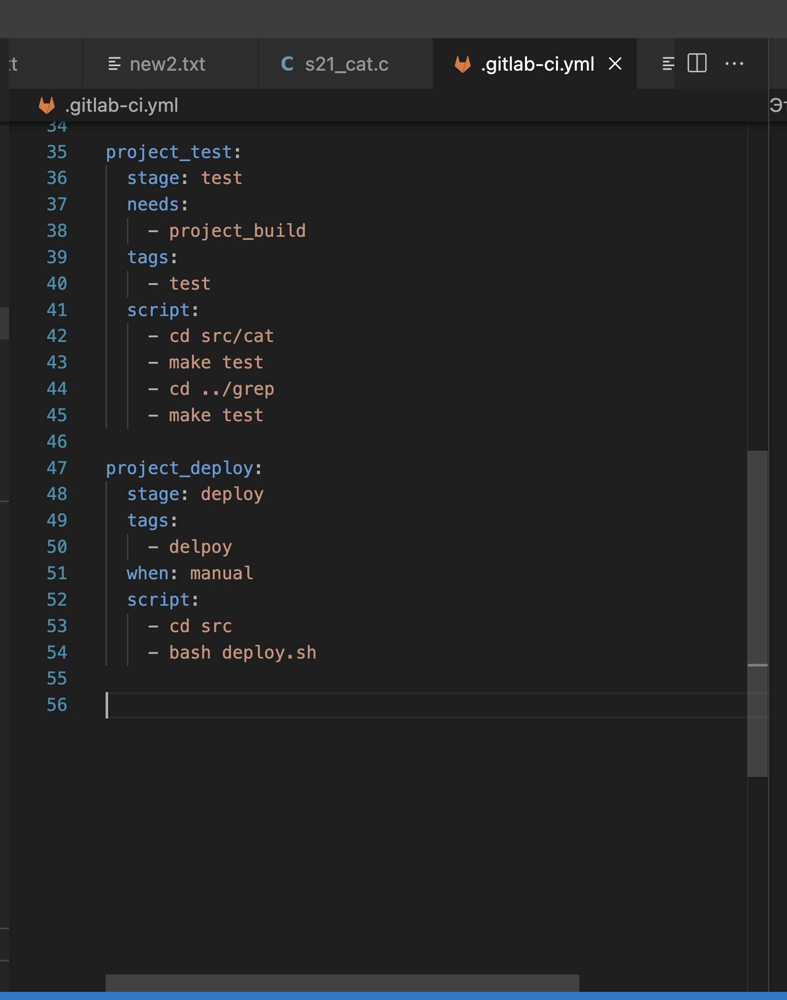

### Part 1. Настройка **gitlab-runner**
**== Задание ==**

*  Подними виртуальную машину *Ubuntu Server 22.04 LTS*.
*Будь готов, что в конце проекта нужно будет сохранить дамп образа виртуальной машины.*


*  Скачай и установи на виртуальную машину **gitlab-runner**.


*  Запусти **gitlab-runner** и зарегистрируй его для использования в текущем проекте (*DO6_CICD*).
- Для регистрации понадобятся URL и токен, которые можно получить на страничке задания на платформе.

- Регистрация Runner: Запустите процесс регистрации, выполнив команду
sudo gitlab-runner register
Когда вы регистрируете GitLab Runner, система просит вас выбрать исполнителя (executor), который определяет среду, в которой будут выполняться задачи CI/CD. Выбор исполнителя зависит от того, как вы хотите запускать свои сборки и тесты, а также от инфраструктуры, доступной для вашего проекта.
- Shell
- Выполняет задачи непосредственно на машине, где запущен GitLab Runner, используя локальный командный интерпретатор. Простой в настройке, но предлагает меньшую изоляцию.





### Part 2. Сборка

`-` Предыдущее испытание было создано, чтобы повышать в людях уверенность в себе.
Теперь я подкорректировала тесты, сделав их более сложными и менее льстивыми.

**== Задание ==**
- Устновим необходимое для вирутальной машины
- sudo apt update && sudo apt install gcc clang-format make git -y


#### Напиши этап для **CI** по сборке приложений из проекта *C2_SimpleBashUtils*.


*  В файле _gitlab-ci.yml_ добавь этап запуска сборки через мейк файл из проекта _C2_.
*  Файлы, полученные после сборки (артефакты), сохрани в произвольную директорию со сроком хранения 30 дней.


### Part 3. Тест кодстайла

`-` Поздравляю, ты выполнил абсолютно бессмысленную задачу. Шучу. Она была нужна для перехода ко всем последующим.

**== Задание ==**

#### Напиши этап для **CI**, который запускает скрипт кодстайла (*clang-format*).

*  Если кодстайл не прошел, то «зафейли» пайплайн.

*  В пайплайне отобрази вывод утилиты *clang-format*.


### Part 4. Интеграционные тесты

`-` Отлично, тест на кодстайл написан. [ТИШЕ] Говорю с тобой тет-а-тет. Не говори ничего коллегам. Между нами: ты справляешься очень хорошо. [ГРОМЧЕ] Переходим к написанию интеграционных тестов.

**== Задание ==**

#### Напиши этап для **CI**, который запускает твои интеграционные тесты из того же проекта.


*  Запусти этот этап автоматически только при условии, если сборка и тест кодстайла прошли успешно.

*  Если тесты не прошли, то «зафейли» пайплайн.

*  В пайплайне отобрази вывод, что интеграционные тесты успешно прошли / провалились.

### Part 5. Этап деплоя

`-` Для завершения этого задания ты должен перенести исполняемые файлы на другую виртуальную машину, которая будет играть роль продакшна. Удачи.

**== Задание ==**

*  Подними вторую виртуальную машину *Ubuntu Server 22.04 LTS*.


#### Напиши этап для **CD**, который «разворачивает» проект на другой виртуальной машине.



*  Запусти этот этап вручную при условии, что все предыдущие этапы прошли успешно.

*  Напиши bash-скрипт, который при помощи **ssh** и **scp** копирует файлы, полученные после сборки (артефакты), в директорию */usr/local/bin* второй виртуальной машины.
*Тут тебе могут помочь знания, полученные в проекте DO2_LinuxNetwork.*

- Будь готов объяснить по скрипту, как происходит перенос.
```
sudo su gitlab-runner
ssh-keygen -t rsa -b 2048
ssh-copy-id turkeysndc@192.168.1.57
ssh turkeysndc@192.168.1.57
```
На виртуальной машине turkeysndc@s21 так же создадим ключ и настроим доступ.
```
ssh-keygen -t rsa -b 2048
ssh-copy-id turkeysn@192.168.1.55
sudo chown -R $(whoami) /usr/local/bin
```
`Команда sudo chown -R $(whoami) /usr/local/bin в Linux используется для изменения владельца и группу всех файлов и каталогов в директории /usr/local/bin на текущего пользователя, который исполняет эту команду. `

*  В файле _gitlab-ci.yml_ добавь этап запуска написанного скрипта.

*  В случае ошибки «зафейли» пайплайн.

В результате ты должен получить готовые к работе приложения из проекта *C2_SimpleBashUtils* (s21_cat и s21_grep) на второй виртуальной машине.


*  Сохрани дампы образов виртуальных машин.
**P.S. Ни в коем случае не сохраняй дампы в гит!**
- Не забудь запустить пайплайн с последним коммитом в репозитории.

### Part 6. Дополнительно. Уведомления

`-` Здесь написано, что твое следующее задание выполняется специально для нобелевских лауреатов. Здесь не сказано, за что они получили премию, но точно не за умение работать с **gitlab-runner**.

**== Задание ==**

*  Настрой уведомления о успешном/неуспешном выполнении пайплайна через бота с именем «[твой nickname] DO6 CI/CD» в *Telegram*.

- Текст уведомления должен содержать информацию об успешности прохождения как этапа **CI**, так и этапа **CD**.
- В остальном текст уведомления может быть произвольным.


